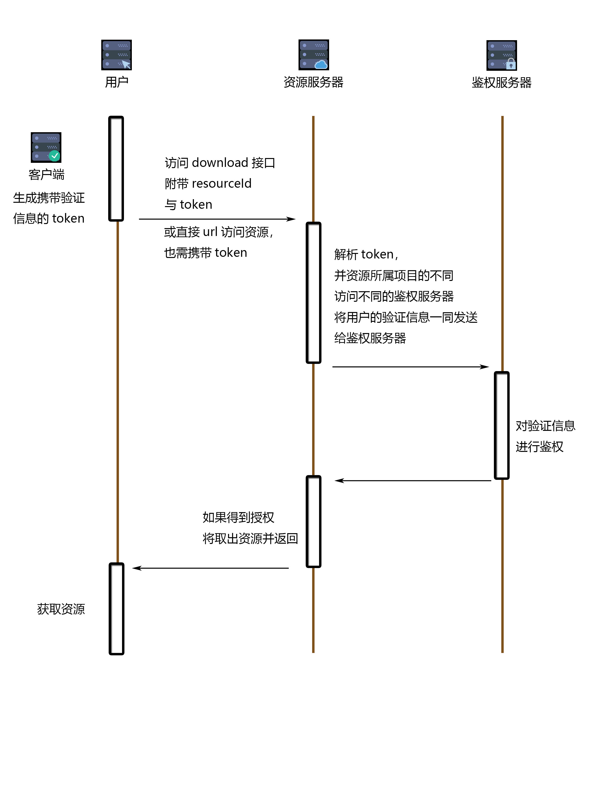

##一、主要控制器阐述
### 1、GenUploadTokenController
用于生成文件上传的token。
上传的token于mongodb中存储，并由UploadTokenPool进行维护，
UploadTokenPool中可设置最大同时有效的token数量。

正确的返回如下：
```json
{
  "code": 200,
  "data": "5a24a12ef832e123587a3c1f",
  "message": "",
  "status": "SUCCESS"
}
```
如果队列已满，则返回以下信息：
```json
{
  "code": 400,
  "data": null,
  "message": "上传token队列已满，请稍后再试。",
  "status": "QUEUE_FULL"
}
```

### 2、UploadController
用于文件上传可自定义参数，参数名以“x|”开头，值随意，但键值对只能一一对应，否则将抛出异常。
```
x|type=avatar&x|classification=animate
```
错误的示范：
```
x|type=avatar&x|type=animate
```
如果正确上传，则会返回：
```json
{
  "code": 200,
  "data": {
    "accessPath": "",
    "id": "5a24a2baf832e115a83dda1a",
    "lock": false,
    "originFileName": "20140620230811_tNYrQ.jpeg",
    "paramMap": {},
    "resourcesId": "5a24a2baf832e115a83dda13",
    "useGridFS": false
  },
  "message": "",
  "status": "SUCCESS"
}
```
###```!!如果该文件没有使用GridFS,那么文件将可以通过地址直接访问，即：accessPath，如：```
```json
{
  "code": 200,
  "data": {
    "accessPath": "resources/test/private/img/016fc7c9e547450e807b1e37fa7f9ab5.JPEG",
    "id": "5a24a350f832e115a83dda1b",
    "lock": false,
    "originFileName": "20140620230811_tNYrQ.jpeg",
    "paramMap": {},
    "resourcesId": "",
    "useGridFS": false
  },
  "message": "",
  "status": "SUCCESS"
}
```
### 3、DownloadController
下载十分简单，只需要资源的id访问DownloadController，或者直接通过accessPath直接访问即可。

但如果文件在上传时被设置为私有资源，即 lock:true

那么该资源在访问时，需要进行鉴权。鉴权失败，则会返回：

```json
{
  "timestamp": "2017-12-04 09:29:49",
  "status": 500,
  "error": "Internal Server Error",
  "exception": "com.raythonsoft.upload.exception.AuthorizedException",
  "message": "验证失败",
  "path": "/download/5a156c202b55b71664a48c48"
}
```

访问需要鉴权的资源，需要附带一个token，token生成规则如下：

* 某需要加密的字符串Str，
* 将资源id的md5作为规则，将Str进行AES加密，得到AESStr
* 将请求者ip作为规则，将AESStr进行AES加密，得到token。

控制器将对token进行解密，并将字符串拼接到该资源注册的鉴权url后，进行get请求。

如：
```
String str = "?userId=1&timestamp=1512352007"
String authUrl = "http://localhost:8080/auth"
///////////
String url = authUrl + str;
```
鉴权服务器若返回"code":200，则请求资源者将可以得到该资源。
```json
{
  "code": 200
}
```
